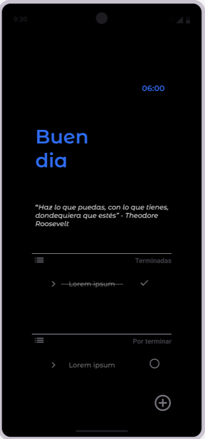
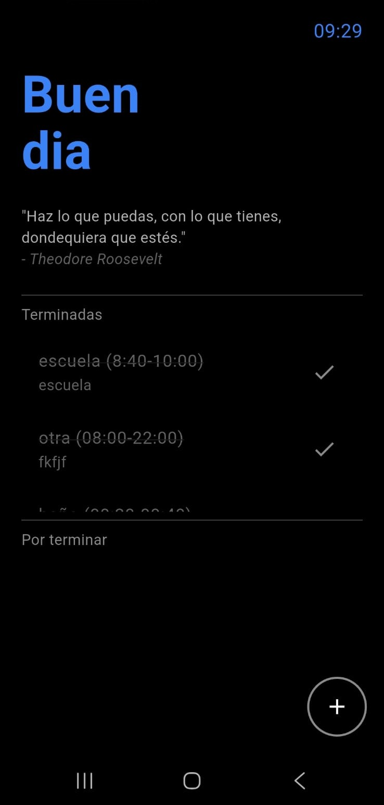

# Aplicación de gestión de tareas (to-do list)

El proyecto consiste en crear una aplicación para dispositivos móviles la cual permita gestionar tareas tales como estudiar, asistir a clase, realizar deporte entre otras. Para 
lograr esto se ha implementado una base de datos usando SQLite,la cual guarda la información en el dispositivo y la muestra en la interfaz mediante diferentes widgets.

## Cómo funciona?

Se tiene una base de datos la cual se crea al momento de inicializar la aplicación por primera vez usando este código:

```
Future _createDB(Database db, int version) async {
    await db.execute('''
      CREATE TABLE tasks (
        id INTEGER PRIMARY KEY AUTOINCREMENT,
        title TEXT NOT NULL,
        description TEXT NOT NULL,
        time TEXT NOT NULL,
        completed INTEGER NOT NULL,
        completedDate TEXT
      )
    ''');

    await db.execute('''
      CREATE TABLE phrases (
        id INTEGER PRIMARY KEY AUTOINCREMENT,
        text TEXT NOT NULL,
        author TEXT NOT NULL
      )
    ''');

    await db.insert('phrases', {
      'text': 'Haz lo que puedas, con lo que tienes, dondequiera que estés.',
      'author': 'Theodore Roosevelt'
    });

    await db.insert('phrases', {
      'text': 'No mires al reloj, haz lo que él hace: sigue moviéndote',
      'author': 'Sam Levenson'
    });

    await db.insert('phrases', {
      'text': 'Quien tiene un porqué para vivir, encontrará casi siempre el cómo',
      'author': 'Nietzsche'
    });
  }
```

Una vez que ya se tiene la base de datos creada se pueden implementar el resto de operaciones
de obtención y modificación de datos.

### Obtención y modificación de datos

Para obtener y modificar la información desde la base de datos se implementan algunas funciones como
la siguiente:

```
Future<List<Task>> getTasksCompletedToday() async {
    final db = await instance.database;

    final now = DateTime.now();
    final startOfDay = DateTime(now.year, now.month, now.day);

    final result = await db.query(
      'tasks',
      where: 'completed = 1 AND completedDate >= ?',
      whereArgs: [startOfDay.toIso8601String()],
      orderBy: 'completedDate DESC',
    );

    return result.map((e) => Task.fromMap(e)).toList();
  }
```
Este tipo de funciones permiten hacer lectura y escritura hacia y desde la base de datos con
los datos del usuario.

### Aspecto visual

En el apartado de la apariencia visual de la aplicación, se utilizaron algunos componentes
visuales de Material Design 3 de Google, para lograr una estética moderna y atractiva
visualmente, a continuación se muestran algunas imágenes:


- Aspecto en Figma:



- Interfaz principal de la aplicación ya programada:


- Formulario para la creación de una tarea:


- Apartado de "Tareas pendientes" dentro de la aplicación:


## Tecnologías usadas

Para desarrollar esta aplicación se utilizaron las siguientes tecnologías:
  - Flutter: framework multiplataforma para desarrollo de aplicaciones móviles
  - Dart: lenguaje de programación encargado de la lógica principal y de los widgets
  - SQLite: persistencia mediante una base de datos

